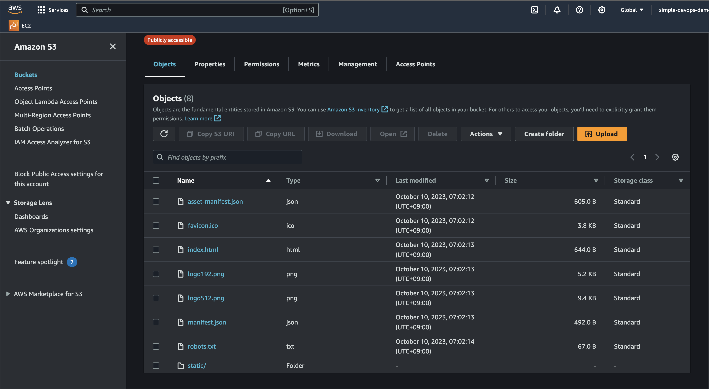

# Deploy-a-Hello-World-React-app-to-AWS-using-S3-CloudFront-ACM-Route53 | AWS-Project
In this repo, I walk you through how to deploy a Hello World React app to AWS using S3, CloudFront, ACM, Route53, and more! Using this approach, you can build a simple react based application that can scale to hundreds of thousands of users. This is a walkthrough documentation with thorough explanations of each step. 


# AWS Services that we are going to use in this project are following:

## Amazon S3 (Simple Storage Service):
- S3 is a scalable object storage service that allows you to store and retrieve data, including files, images, and backups, on the internet.
- It provides high durability, availability, and security for your data.
- S3 is commonly used for static website hosting, data backup, and as a storage backend for various applications.

## Amazon CloudFront:

- CloudFront is a content delivery network (CDN) service that accelerates the delivery of web content, including static and dynamic assets, to users around the world.
- It caches content at edge locations globally, reducing latency and improving website and application performance.
- CloudFront can also provide secure and scalable distribution for APIs and streaming media.

## AWS Certificate Manager (ACM):

- ACM is a service that simplifies the process of obtaining and managing SSL/TLS certificates for your websites and applications.
- It offers free SSL/TLS certificates that can be used with AWS services like CloudFront, Elastic Load Balancing, and API Gateway.
- ACM automates certificate renewal and provides a highly secure way to enable HTTPS

## Amazon Route 53:

- Route 53 is a scalable and highly available domain name system (DNS) web service.
- It allows you to register and manage domain names and route incoming traffic to various AWS resources, including S3 buckets, CloudFront distributions, and EC2 instances.
- Route 53 also offers advanced features like health checks and traffic routing policies for high availability and fault tolerance.

# Project Steps to follow:

1. Set up your React app or copy your existing React app code into the project directory and install dependencies and build your React app:

Make sure you have npm/npx installed!
Run following codes in your terminal

   ```
    npx create-react-app demo-app 
    cd demo-app
    npm start
    # Run Control + C to exit and run following code:
    npm run build
   ```

2. Create Amazon S3 buckets. In this 2nd stage you're going to create two S3 buckets one with www and one with actual name of your website

- Create your first bucket with www and make sure to choose bucket name same as your website like:
  - Bucket name: I will use awsprojects.com as an  example but make sure to choose same name as your website name.
  - Bucket name: www.awsprojects.com
  - Leave all the default configurations and we will comeback again later in the following steps

- Create your second bucket without www:
  - Bucket name: awsprojects.com
  - Leave all the default configurations

3. Upload your React App build files to www bucket:
  - Go to your www.awsprojects.com bucket and upload all the files by going to demo-app folder -> build and make to upload static folder seperately
  - Here is an example image that shows you uploaded React app build files:
  

 
  
